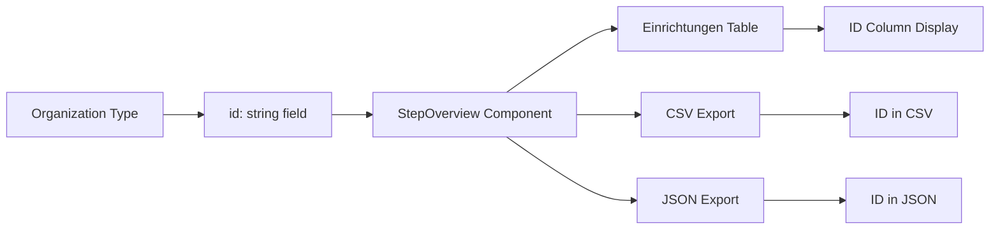

# ID-Spalte zur Einrichtungen-Tabelle hinzufügen

## Übersicht

Fügen Sie eine "ID"-Spalte als erste Spalte zur Einrichtungen-Tabelle in Tab 8 (Übersicht) hinzu, die die tatsächliche Datensatz-ID aus der Datenbank anzeigt.

## Betroffene Datei

- [`src/components/steps/StepOverview.tsx`](src/components/steps/StepOverview.tsx)

## Implementierungsdetails

### 1. Tabellen-Header aktualisieren (Zeile 241-249)

**Aktuelle Struktur:**
```tsx
<TableHeader>
  <TableRow>
    <TableHead>Name</TableHead>
    <TableHead className="hidden md:table-cell">Adresse</TableHead>
    <TableHead>Trägerorganisation</TableHead>
    <TableHead className="hidden lg:table-cell">Ansprechpersonen</TableHead>
    <TableHead className="hidden lg:table-cell">E-Mail</TableHead>
    <TableHead className="hidden lg:table-cell">Heyflows</TableHead>
  </TableRow>
</TableHeader>
```

**Neue Struktur:**
```tsx
<TableHeader>
  <TableRow>
    <TableHead>ID</TableHead>
    <TableHead>Name</TableHead>
    <TableHead className="hidden md:table-cell">Adresse</TableHead>
    <TableHead>Trägerorganisation</TableHead>
    <TableHead className="hidden lg:table-cell">Ansprechpersonen</TableHead>
    <TableHead className="hidden lg:table-cell">E-Mail</TableHead>
    <TableHead className="hidden lg:table-cell">Heyflows</TableHead>
  </TableRow>
</TableHeader>
```

### 2. Tabellen-Zeilen aktualisieren (Zeile 252-299)

**Aktuelle Struktur:**
```tsx
<TableRow key={e.id}>
  <TableCell className="font-medium">{e.name}</TableCell>
  <TableCell className="hidden md:table-cell text-muted-foreground">
    {e.street}, {e.zipCode} {e.city}
  </TableCell>
  {/* ... weitere Zellen */}
</TableRow>
```

**Neue Struktur:**
```tsx
<TableRow key={e.id}>
  <TableCell className="text-muted-foreground">{e.id}</TableCell>
  <TableCell className="font-medium">{e.name}</TableCell>
  <TableCell className="hidden md:table-cell text-muted-foreground">
    {e.street}, {e.zipCode} {e.city}
  </TableCell>
  {/* ... weitere Zellen */}
</TableRow>
```

### 3. CSV-Export aktualisieren (Zeile 95-111)

**Aktueller Header (Zeile 97):**
```typescript
const einrichtungenHeader = ['Name', 'Straße', 'PLZ', 'Stadt', 'Trägerorganisation', 'Ansprechpersonen', 'E-Mails', 'Heyflows'];
```

**Neuer Header:**
```typescript
const einrichtungenHeader = ['ID', 'Name', 'Straße', 'PLZ', 'Stadt', 'Trägerorganisation', 'Ansprechpersonen', 'E-Mails', 'Heyflows'];
```

**Aktuelle Zeilen (Zeile 98-111):**
```typescript
const einrichtungenRows = einrichtungen.map(e => {
  const contacts = getContacts(e.contactPersonIds);
  const hfs = getHeyflows(e.heyflowIds);
  return [
    `"${e.name}"`,
    `"${e.street}"`,
    e.zipCode,
    `"${e.city}"`,
    `"${getTraegerName(e.parentOrganizationId)}"`,
    `"${contacts.map(c => c.name).join(', ')}"`,
    `"${contacts.map(c => c.email).join(', ')}"`,
    `"${hfs.map(h => h.designation).join(', ')}"`,
  ].join(';');
});
```

**Neue Zeilen:**
```typescript
const einrichtungenRows = einrichtungen.map(e => {
  const contacts = getContacts(e.contactPersonIds);
  const hfs = getHeyflows(e.heyflowIds);
  return [
    e.id,  // ID als erste Spalte
    `"${e.name}"`,
    `"${e.street}"`,
    e.zipCode,
    `"${e.city}"`,
    `"${getTraegerName(e.parentOrganizationId)}"`,
    `"${contacts.map(c => c.name).join(', ')}"`,
    `"${contacts.map(c => c.email).join(', ')}"`,
    `"${hfs.map(h => h.designation).join(', ')}"`,
  ].join(';');
});
```

### 4. JSON-Export überprüfen (Zeile 69-82)

Der JSON-Export verwendet bereits die kompletten Einrichtungsobjekte. Die ID ist bereits im Export enthalten, da das Mapping direkt auf die Einrichtungen zugreift. Es werden spezifische Felder exportiert, aber die ID wird **nicht** explizit hinzugefügt.

**Aktueller Code:**
```typescript
einrichtungen: einrichtungen.map(e => ({
  name: e.name,
  adresse: `${e.street}, ${e.zipCode} ${e.city}`,
  traegerorganisation: getTraegerName(e.parentOrganizationId),
  ansprechpersonen: getContacts(e.contactPersonIds).map(c => ({
    name: c.name,
    email: c.email,
  })),
  heyflows: getHeyflows(e.heyflowIds).map(h => ({
    id: h.heyflowId,
    bezeichnung: h.designation,
    url: h.url,
  })),
})),
```

**Vorschlag: ID hinzufügen:**
```typescript
einrichtungen: einrichtungen.map(e => ({
  id: e.id,  // ID hinzufügen
  name: e.name,
  adresse: `${e.street}, ${e.zipCode} ${e.city}`,
  traegerorganisation: getTraegerName(e.parentOrganizationId),
  ansprechpersonen: getContacts(e.contactPersonIds).map(c => ({
    name: c.name,
    email: c.email,
  })),
  heyflows: getHeyflows(e.heyflowIds).map(h => ({
    id: h.heyflowId,
    bezeichnung: h.designation,
    url: h.url,
  })),
})),
```

## Zusammenfassung der Änderungen

1. **Tabellen-Header:** Fügen Sie `<TableHead>ID</TableHead>` als erste Spalte hinzu
2. **Tabellen-Zeilen:** Fügen Sie `<TableCell className="text-muted-foreground">{e.id}</TableCell>` als erste Zelle hinzu
3. **CSV-Export:** Fügen Sie 'ID' zum Header und `e.id` als ersten Wert in jeder Zeile hinzu
4. **JSON-Export:** Fügen Sie `id: e.id` zum Einrichtungen-Mapping hinzu

## Visuelle Darstellung

Die ID-Spalte wird:
- Immer sichtbar sein (keine responsive Ausblendung)
- Mit `text-muted-foreground` styling versehen (gedämpfte Textfarbe für weniger Betonung)
- Die tatsächliche UUID/Datensatz-ID aus der Datenbank anzeigen
- Als erste Spalte vor "Name" erscheinen

## Dateifluss



## Technische Hinweise

- Die [`Organization`](src/types/organization.ts:3-16) Interface enthält bereits ein `id`-Feld vom Typ `string`
- Jede Einrichtung hat eine eindeutige ID, die über `e.id` zugänglich ist
- Die Filterung/Suche beeinflusst nicht die ID-Werte, da sie direkt aus den Organisationsobjekten stammen
- Die ID wird unverändert in der Datenbank-Form angezeigt (wahrscheinlich UUID-Format)
