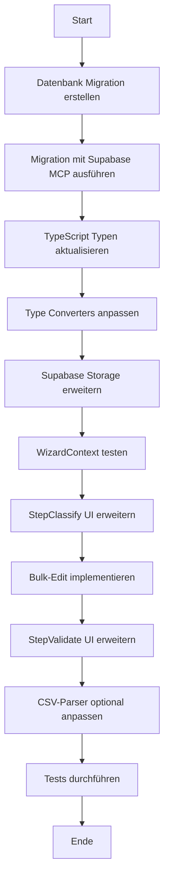
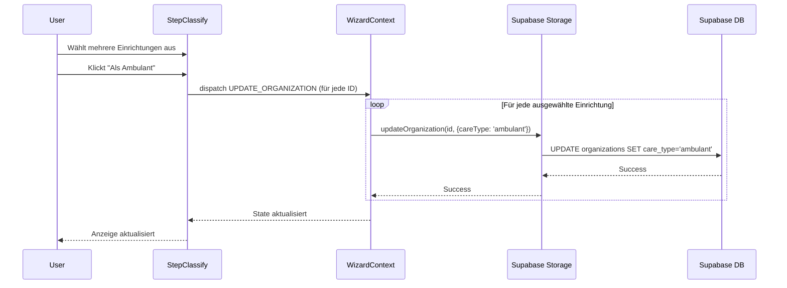

# Plan: Ambulant/Stationär Auswahl für Einrichtungen

## Übersicht
Erweiterung der Anwendung um eine Auswahl "Ambulant / Stationär" für jede Einrichtung. Die Funktion soll sowohl Einzelbearbeitung als auch Bulk-Edit unterstützen.

## Anforderungen
- ✅ Neue Eigenschaften für Einrichtungen: `isAmbulant` und `isStationaer` (beide Boolean)
- ✅ Einrichtung kann **BEIDES** sein (ambulant UND stationär)
- ✅ Beide `false` bedeutet "offen" / noch nicht festgelegt
- ✅ Bulk-Edit Funktionalität (mehrere Einrichtungen gleichzeitig bearbeiten)
- ✅ Einzelbearbeitung möglich
- ✅ Import-Daten können geändert werden
- ✅ UI-Integration in bestehende Schritte

## Datenbank-Änderungen

### Migration: `is_ambulant` und `is_stationaer` Spalten hinzufügen

```sql
-- Add care type columns to organizations table
ALTER TABLE organizations
ADD COLUMN is_ambulant BOOLEAN DEFAULT false,
ADD COLUMN is_stationaer BOOLEAN DEFAULT false;

-- Add comments for documentation
COMMENT ON COLUMN organizations.is_ambulant IS
'Whether the facility provides ambulant (outpatient) care. Only applicable for type=einrichtung';

COMMENT ON COLUMN organizations.is_stationaer IS
'Whether the facility provides stationaer (inpatient) care. Only applicable for type=einrichtung';

-- Create indexes for better query performance
CREATE INDEX idx_organizations_is_ambulant ON organizations(is_ambulant)
WHERE type = 'einrichtung' AND is_ambulant = true;

CREATE INDEX idx_organizations_is_stationaer ON organizations(is_stationaer)
WHERE type = 'einrichtung' AND is_stationaer = true;
```

**Wichtig**:
- Zwei separate Boolean-Spalten ermöglichen BEIDE gleichzeitig
- Default `false` = noch nicht festgelegt
- Beide `false` = offen / unklar
- Beide `true` = ambulant UND stationär (A & S)
- Indexes nur für Einrichtungen mit true-Werten

## TypeScript-Änderungen

### 1. Organization Type erweitern

**Datei**: [`src/types/organization.ts`](src/types/organization.ts:3)

```typescript
export interface Organization {
  id: string;
  name: string;
  street: string;
  zipCode: string;
  city: string;
  type: 'traeger' | 'einrichtung' | null;
  isAmbulant: boolean;      // NEU: Bietet ambulante Versorgung
  isStationaer: boolean;    // NEU: Bietet stationäre Versorgung
  isValidated: boolean;
  parentOrganizationId?: string;
  contactPersonIds: string[];
  heyflowIds: string[];
  createdAt: string;
  updatedAt: string;
}
```

### 2. Type Converters aktualisieren

**Datei**: [`src/lib/type-converters.ts`](src/lib/type-converters.ts:1)

```typescript
// In dbToOrganization:
isAmbulant: dbOrg.is_ambulant ?? false,
isStationaer: dbOrg.is_stationaer ?? false,

// In organizationToDb:
is_ambulant: org.isAmbulant ?? false,
is_stationaer: org.isStationaer ?? false,
```

### 3. Supabase Storage Funktionen

**Datei**: [`src/lib/supabase-storage.ts`](src/lib/supabase-storage.ts:351)

In der `updateOrganization` Funktion:
```typescript
if (updates.isAmbulant !== undefined) {
  dbUpdates.is_ambulant = updates.isAmbulant;
}
if (updates.isStationaer !== undefined) {
  dbUpdates.is_stationaer = updates.isStationaer;
}
```

## UI-Änderungen

### 1. StepClassify - Erste Erfassung

**Datei**: [`src/components/steps/StepClassify.tsx`](src/components/steps/StepClassify.tsx:1)

**Änderungen**:
- Neue Spalte in Tabelle für Einrichtungen: "Versorgungsart"
- Badge zeigt Status: "Ambulant", "Stationär" oder "Offen"
- Buttons/Dropdown für schnelle Auswahl
- Bulk-Edit: Zusätzliche Buttons für "Als Ambulant" / "Als Stationär"

**UI-Layout**:
```
┌──────────────────────────────────────────────────────────────┐
│ □ | Name | Adresse | Stadt | Typ | Versorgung | Aktion      │
├──────────────────────────────────────────────────────────────┤
│ □ | Pflegeheim XY | ... | ... | Einrichtung | [Offen]       │
│   [Träger] [Einrichtung] [☐ Ambulant] [☐ Stationär] [🗑️]   │
│                                                              │
│ □ | Klinik ABC | ... | ... | Einrichtung | [A & S]          │
│   [Träger] [Einrichtung] [☑ Ambulant] [☑ Stationär] [🗑️]   │
└──────────────────────────────────────────────────────────────┘
```

**Versorgung Badge zeigt**:
- `[Offen]` - wenn beide false
- `[Ambulant]` - nur isAmbulant true
- `[Stationär]` - nur isStationaer true
- `[A & S]` - beide true

**Bulk-Edit Bar** (wenn Einrichtungen ausgewählt):
```
┌──────────────────────────────────────────────────────────┐
│ 5 Einträge ausgewählt                                    │
│ [Träger] [Einrichtung] │ Versorgung: [Ambulant] [Stationär] [Zurücksetzen] │ [Löschen] │
└──────────────────────────────────────────────────────────┘
```

**Bulk-Edit Verhalten**:
- Button "Ambulant" → Toggle `isAmbulant` für alle ausgewählten
- Button "Stationär" → Toggle `isStationaer` für alle ausgewählten
- Button "Zurücksetzen" → Setzt beide auf `false`

### 2. StepValidate - Validierung & Bearbeitung

**Datei**: [`src/components/steps/StepValidate.tsx`](src/components/steps/StepValidate.tsx:1)

**Änderungen für Einrichtungen**:
- Zusätzliche Spalte "Versorgungsart"
- Im Edit-Modus: Dropdown für careType
- Anzeige als Badge im Lesemodus

**Edit-Modus** (für Einrichtungen):
```typescript
<div className="flex gap-2">
  <Checkbox
    checked={editForm.isAmbulant}
    onCheckedChange={(checked) =>
      setEditForm({ ...editForm, isAmbulant: !!checked })
    }
  />
  <Label>Ambulant</Label>
  
  <Checkbox
    checked={editForm.isStationaer}
    onCheckedChange={(checked) =>
      setEditForm({ ...editForm, isStationaer: !!checked })
    }
  />
  <Label>Stationär</Label>
</div>
```

### 3. Optional: StepOverview - Anzeige

**Datei**: [`src/components/steps/StepOverview.tsx`](src/components/steps/StepOverview.tsx)

**Statistik erweitern**:
- Anzahl ambulante Einrichtungen
- Anzahl stationäre Einrichtungen
- Anzahl noch offene Einrichtungen

## Implementierungs-Workflow



## Datenfluss: Bulk-Edit



## CSV-Import Anpassung (Optional)

Falls zukünftige Importe bereits Versorgungsart enthalten:

**Datei**: [`src/lib/csv-parser.ts`](src/lib/csv-parser.ts)

Mapping erweitern:
```typescript
const versorgung = row['Versorgungsart']?.toLowerCase() || '';
isAmbulant: versorgung.includes('ambulant'),
isStationaer: versorgung.includes('stationär') || versorgung.includes('stationaer'),
```

Unterstützt Formate wie:
- "Ambulant" → isAmbulant: true
- "Stationär" → isStationaer: true
- "Ambulant & Stationär" → beide true
- "A & S" → beide true (wenn explizit gemapped)

## Statistiken & Helper-Funktionen

**Datei**: [`src/lib/storage.ts`](src/lib/storage.ts:137)

```typescript
export const getCareTypeStats = (organizations: Organization[]) => {
  const einrichtungen = organizations.filter(o => o.type === 'einrichtung');
  const nurAmbulant = einrichtungen.filter(o => o.isAmbulant && !o.isStationaer).length;
  const nurStationaer = einrichtungen.filter(o => !o.isAmbulant && o.isStationaer).length;
  const beides = einrichtungen.filter(o => o.isAmbulant && o.isStationaer).length;
  const offen = einrichtungen.filter(o => !o.isAmbulant && !o.isStationaer).length;
  
  return {
    nurAmbulant,
    nurStationaer,
    beides,
    offen,
    total: einrichtungen.length,
    // Helper: Gesamtzahl mit ambulanter Versorgung
    mitAmbulant: nurAmbulant + beides,
    // Helper: Gesamtzahl mit stationärer Versorgung
    mitStationaer: nurStationaer + beides,
  };
};
```

## Testing-Checkliste

Nach der Implementierung testen:

- [ ] Datenbank-Spalten existieren als Boolean
- [ ] Einzelne Einrichtung kann auf "nur Ambulant" gesetzt werden
- [ ] Einzelne Einrichtung kann auf "nur Stationär" gesetzt werden
- [ ] Einzelne Einrichtung kann auf "Ambulant UND Stationär" (beides) gesetzt werden
- [ ] Einzelne Einrichtung kann auf "Offen" (beide false) zurückgesetzt werden
- [ ] Bulk-Edit: Toggle Ambulant für mehrere Einrichtungen
- [ ] Bulk-Edit: Toggle Stationär für mehrere Einrichtungen
- [ ] Bulk-Edit: Zurücksetzen (beide false) für mehrere Einrichtungen
- [ ] Träger werden nicht von isAmbulant/isStationaer beeinflusst
- [ ] Werte werden korrekt in Datenbank gespeichert
- [ ] Werte bleiben nach Reload erhalten
- [ ] UI zeigt korrekte Badges an
- [ ] Statistiken werden korrekt berechnet

## Sicherheitsüberlegungen

- Row Level Security (RLS) Policies bleiben unverändert
- Boolean-Spalten mit Default `false`, kein Breaking Change für existierende Daten
- Keine zusätzlichen Constraints nötig (Boolean-Type ist bereits sicher)
- Nur relevant für `type='einrichtung'` (wird in UI Logik berücksichtigt)

## Performance

- Partial Indexes auf `is_ambulant` und `is_stationaer` für schnelle Filterung
- Bulk-Updates laufen in Transaktion (durch Supabase)
- Keine zusätzlichen Joins erforderlich (Spalten in Haupttabelle)
- Boolean-Operationen sind sehr performant

## Rollback-Plan

Falls Probleme auftreten:

```sql
-- Spalten entfernen (wenn nötig)
ALTER TABLE organizations
DROP COLUMN IF EXISTS is_ambulant,
DROP COLUMN IF EXISTS is_stationaer;

-- Indexes entfernen
DROP INDEX IF EXISTS idx_organizations_is_ambulant;
DROP INDEX IF EXISTS idx_organizations_is_stationaer;
```

TypeScript-Code kann durch Git revert wiederhergestellt werden.

## Zeitplan

Die Implementierung erfolgt in dieser Reihenfolge:
1. **Backend** (Datenbank + Type System): ~30 Minuten
2. **Data Layer** (Storage + Converters): ~15 Minuten  
3. **UI Components** (StepClassify + StepValidate): ~45 Minuten
4. **Testing & Bugfixes**: ~30 Minuten

**Gesamt**: ~2 Stunden

---

## Nächste Schritte

1. ✅ Plan review und Approval
2. Migration in Supabase erstellen und ausführen
3. Code-Änderungen implementieren
4. Testen
5. Dokumentation aktualisieren
