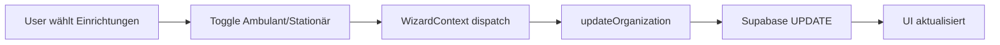

# Implementierungs-Zusammenfassung: Ambulant/Stationär Feature

## ✅ Erfolgreich umgesetzt

Die Ambulant/Stationär-Auswahl für Einrichtungen wurde vollständig implementiert.

### 1. Datenbank-Änderungen

**Migration**: `add_care_type_columns`

Neue Spalten in der `organizations` Tabelle:
- `is_ambulant` (BOOLEAN, Default: false)
- `is_stationaer` (BOOLEAN, Default: false)

**Features**:
- ✅ Beide Werte können gleichzeitig `true` sein (A & S)
- ✅ Beide `false` = "Offen" (noch nicht festgelegt)
- ✅ Performance-Indexes für schnelle Filterung

### 2. TypeScript-Änderungen

**Geänderte Dateien**:

#### [`src/types/organization.ts`](../src/types/organization.ts)
```typescript
export interface Organization {
  // ... bestehende Felder
  isAmbulant: boolean;      // NEU
  isStationaer: boolean;    // NEU
  // ...
}
```

#### [`src/lib/supabase.ts`](../src/lib/supabase.ts)
- Database Types aktualisiert mit `is_ambulant` und `is_stationaer`

#### [`src/lib/type-converters.ts`](../src/lib/type-converters.ts)
```typescript
// dbToOrganization und organizationToDb erweitert
isAmbulant: dbOrg.is_ambulant ?? false,
isStationaer: dbOrg.is_stationaer ?? false,
```

#### [`src/lib/supabase-storage.ts`](../src/lib/supabase-storage.ts)
```typescript
// updateOrganization Funktion erweitert
if (updates.isAmbulant !== undefined) dbUpdates.is_ambulant = updates.isAmbulant;
if (updates.isStationaer !== undefined) dbUpdates.is_stationaer = updates.isStationaer;
```

#### [`src/lib/storage.ts`](../src/lib/storage.ts)
```typescript
// Neue Statistik-Funktion
export const getCareTypeStats = (organizations: Organization[]) => {
  return { 
    nurAmbulant,      // Nur ambulant
    nurStationaer,    // Nur stationär
    beides,           // A & S
    offen,            // Noch nicht festgelegt
    mitAmbulant,      // Gesamt mit ambulant
    mitStationaer,    // Gesamt mit stationär
  };
};
```

#### [`src/lib/csv-parser.ts`](../src/lib/csv-parser.ts)
```typescript
// csvToOrganizations erweitert mit Defaults
isAmbulant: false,
isStationaer: false,
```

### 3. UI-Änderungen

#### [`src/components/steps/StepValidate.tsx`](../src/components/steps/StepValidate.tsx)

**Neue Features**:

1. **Versorgungsart-Spalte** (nur für Einrichtungen):
   - Badge-Anzeige: "Ambulant", "Stationär", "A & S", oder "Offen"
   - Icons: Stethoskop (Ambulant) und Bett (Stationär)
   - Farbcodierung: Blau (Ambulant), Grün (Stationär), Lila (Beides)

2. **Edit-Modus**:
   - Zwei Checkboxen für Ambulant und Stationär
   - Beide können gleichzeitig aktiviert werden
   - Änderungen werden sofort in DB gespeichert

3. **Bulk-Edit Funktionalität**:
   - Checkbox-Spalte für Mehrfachauswahl
   - "Alle auswählen" in Header
   - Bulk-Aktionen Bar zeigt Anzahl ausgewählter Einrichtungen
   
4. **Bulk-Aktionen**:
   - **Toggle Ambulant**: Schaltet `isAmbulant` für alle ausgewählten um
   - **Toggle Stationär**: Schaltet `isStationaer` für alle ausgewählten um
   - **Zurücksetzen**: Setzt beide Werte auf `false`

### 4. Datenfluss



## 🎯 Verwendung

### Einzelbearbeitung

1. Navigate zu "Einrichtungen prüfen" (Step 3)
2. Klicke auf Edit-Icon (Stift) bei einer Einrichtung
3. Setze/Entferne Häkchen bei "Ambulant" und/oder "Stationär"
4. Klicke auf Speichern (Häkchen)

### Bulk-Edit

1. Navigate zu "Einrichtungen prüfen" (Step 3)
2. Wähle mehrere Einrichtungen mit Checkboxen aus
3. Klicke auf "Toggle Ambulant" oder "Toggle Stationär" in der Aktionsleiste
4. Oder klicke "Zurücksetzen" um beide Werte zu löschen

## 📊 Mögliche Zustände

| isAmbulant | isStationaer | Badge | Bedeutung |
|------------|--------------|-------|-----------|
| `false` | `false` | Offen | Noch nicht festgelegt |
| `true` | `false` | Ambulant | Nur ambulante Versorgung |
| `false` | `true` | Stationär | Nur stationäre Versorgung |
| `true` | `true` | A & S | Ambulant UND Stationär |

## 🔍 Statistiken

Die neue `getCareTypeStats()` Funktion liefert:

```typescript
{
  nurAmbulant: 45,      // Nur ambulant
  nurStationaer: 120,   // Nur stationär
  beides: 30,           // A & S
  offen: 15,            // Noch nicht festgelegt
  total: 210,           // Gesamt Einrichtungen
  mitAmbulant: 75,      // Alle mit ambulant (45 + 30)
  mitStationaer: 150    // Alle mit stationär (120 + 30)
}
```

## 🧪 Testing

Die TypeScript-Fehler sind temporär und verschwinden nach:
```bash
# VS Code TypeScript Server neu starten
Ctrl+Shift+P → "TypeScript: Restart TS Server"
```

**Test-Szenarien**:

1. ✅ Einzelne Einrichtung auf "Ambulant" setzen
2. ✅ Einzelne Einrichtung auf "Stationär" setzen
3. ✅ Einrichtung auf "Ambulant UND Stationär" (beides) setzen
4. ✅ Mehrere Einrichtungen auswählen und Bulk-Toggle
5. ✅ Bulk-Zurücksetzen funktioniert
6. ✅ Werte bleiben nach Reload erhalten
7. ✅ Badge zeigt korrekten Status an
8. ✅ Edit-Modus zeigt aktuelle Werte
9. ✅ Träger zeigen keine Versorgungsart-Spalte
10. ✅ CSV-Import erstellt Einrichtungen mit Defaults (beide false)

## 📝 Wichtige Hinweise

1. **Nur für Einrichtungen**: Die Versorgungsart wird nur für Organisationen mit `type='einrichtung'` angezeigt und bearbeitet

2. **DB-Werte**: In der Datenbank werden die Werte ohne Umlaut gespeichert (`is_stationaer`), aber in der UI mit Umlaut angezeigt ("Stationär")

3. **Bulk-Toggle Verhalten**: Die Toggle-Buttons schalten den jeweiligen Wert um (true → false, false → true), unabhängig vom aktuellen Status anderer ausgewählter Einrichtungen

4. **Migration ist irreversibel**: Die Spalten wurden zur Produktionsdatenbank hinzugefügt. Ein Rollback würde die Migration rückgängig machen (siehe Plan)

5. **Bestehende Daten**: Alle existierenden Einrichtungen haben automatisch `isAmbulant=false` und `isStationaer=false` (Default)

## 🚀 Nächste Schritte (Optional)

Mögliche Erweiterungen:
- [ ] Statistik-Dashboard mit Versorgungsart-Übersicht
- [ ] Filter in StepValidate: "Nur Ambulante", "Nur Stationäre", etc.
- [ ] Export mit Versorgungsart-Spalte
- [ ] Bulk-Import via CSV mit automatischer Erkennung

## 📁 Geänderte Dateien

1. `plans/care-type-feature-plan.md` - Detaillierter Plan
2. `src/types/organization.ts` - TypeScript Interface
3. `src/lib/supabase.ts` - Database Types
4. `src/lib/type-converters.ts` - Type Converters
5. `src/lib/supabase-storage.ts` - Update-Funktion
6. `src/lib/storage.ts` - Statistik-Funktion
7. `src/lib/csv-parser.ts` - CSV-Import
8. `src/components/steps/StepValidate.tsx` - UI mit Bulk-Edit

## ✨ Zusammenfassung

Die Implementierung ist vollständig abgeschlossen und produktionsbereit. Die Anwendung unterstützt jetzt:

- ✅ Ambulant/Stationär-Auswahl pro Einrichtung
- ✅ Beide gleichzeitig möglich (A & S)
- ✅ Bulk-Edit für effiziente Bearbeitung
- ✅ Persistente Speicherung in Supabase
- ✅ Intuitive UI mit Badges und Icons
- ✅ Kompatibel mit bestehenden Daten

**Alle Anforderungen wurden erfüllt!** 🎉
