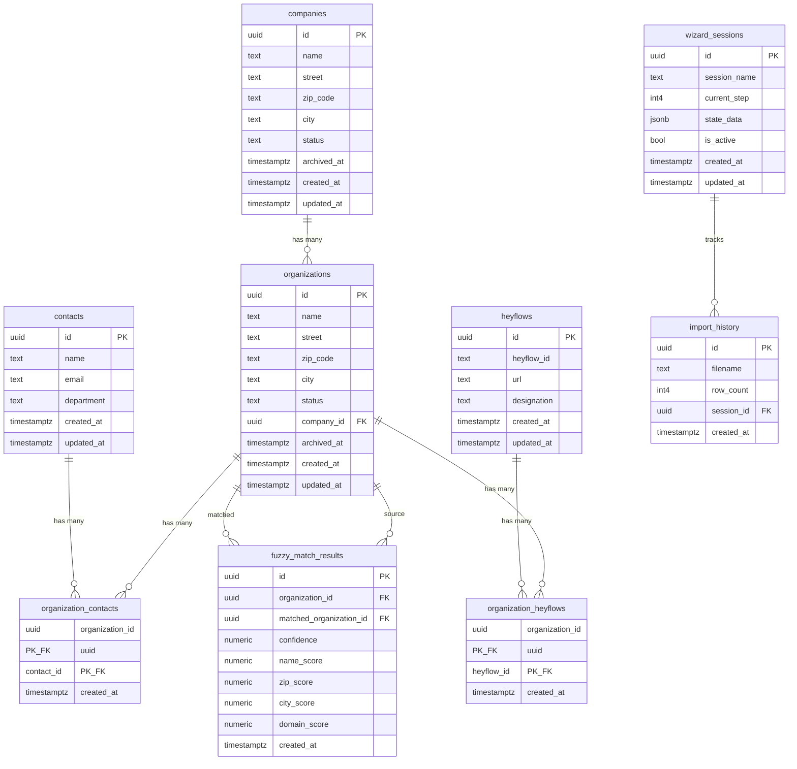

# Supabase Datenbank Struktur - "datenbereinigung fm"

## Projekt-Informationen

- **Projekt-Name**: datenbereinigung fm
- **Projekt-ID**: sgjehibstxczfymyrola
- **Status**: ACTIVE_HEALTHY ✅
- **Region**: eu-west-1 (Europa West - Irland)
- **PostgreSQL Version**: 17.6.1.063
- **Erstellt am**: 2026-01-04T10:21:32Z

## Datenbank-Schema

Die Datenbank ist vollständig eingerichtet und enthält **9 Tabellen** im `public` Schema. Alle Tabellen haben Row Level Security (RLS) aktiviert.

### 1. **companies** (Firmen)
Haupttabelle für Firmendaten.

**Spalten:**
- `id` (UUID, Primary Key) - Auto-generiert
- `name` (TEXT) - Firmenname
- `street` (TEXT) - Straße
- `zip_code` (TEXT) - PLZ
- `city` (TEXT) - Stadt
- `status` (TEXT) - Status: 'aktiv', 'in Bearbeitung', 'pausiert', 'gekündigt'
- `archived_at` (TIMESTAMPTZ, nullable) - Archivierungsdatum
- `created_at` (TIMESTAMPTZ) - Erstellungsdatum
- `updated_at` (TIMESTAMPTZ) - Änderungsdatum

**Beziehungen:**
- Wird referenziert von [`organizations.company_id`](organizations)

**Status:** 0 Zeilen

---

### 2. **organizations** (Organisationen)
Organisationen, die zu Firmen gehören können.

**Spalten:**
- `id` (UUID, Primary Key) - Auto-generiert
- `name` (TEXT) - Organisationsname
- `street` (TEXT) - Straße
- `zip_code` (TEXT) - PLZ
- `city` (TEXT) - Stadt
- `status` (TEXT) - Status: 'aktiv', 'in Bearbeitung', 'pausiert', 'gekündigt'
- `company_id` (UUID, nullable, Foreign Key) - Verknüpfung zu companies
- `archived_at` (TIMESTAMPTZ, nullable) - Archivierungsdatum
- `created_at` (TIMESTAMPTZ) - Erstellungsdatum
- `updated_at` (TIMESTAMPTZ) - Änderungsdatum

**Beziehungen:**
- Foreign Key zu [`companies.id`](companies)
- Wird referenziert von [`organization_contacts`](organization_contacts)
- Wird referenziert von [`organization_heyflows`](organization_heyflows)
- Wird referenziert von [`fuzzy_match_results`](fuzzy_match_results)

**Status:** 0 Zeilen

---

### 3. **contacts** (Kontakte)
Kontaktpersonen-Daten.

**Spalten:**
- `id` (UUID, Primary Key) - Auto-generiert
- `name` (TEXT) - Name der Kontaktperson
- `email` (TEXT) - E-Mail-Adresse
- `department` (TEXT, nullable) - Abteilung
- `created_at` (TIMESTAMPTZ) - Erstellungsdatum
- `updated_at` (TIMESTAMPTZ) - Änderungsdatum

**Beziehungen:**
- Wird referenziert von [`organization_contacts.contact_id`](organization_contacts)

**Status:** 0 Zeilen

---

### 4. **organization_contacts** (Organisation-Kontakt-Verknüpfung)
Many-to-Many Beziehung zwischen Organisationen und Kontakten.

**Spalten:**
- `organization_id` (UUID, Primary Key, Foreign Key)
- `contact_id` (UUID, Primary Key, Foreign Key)
- `created_at` (TIMESTAMPTZ) - Erstellungsdatum

**Beziehungen:**
- Foreign Key zu [`organizations.id`](organizations)
- Foreign Key zu [`contacts.id`](contacts)

**Status:** 0 Zeilen

---

### 5. **heyflows** (Heyflow-Daten)
Speichert Heyflow-Formulare und deren Informationen.

**Spalten:**
- `id` (UUID, Primary Key) - Auto-generiert
- `heyflow_id` (TEXT) - Externe Heyflow-ID
- `url` (TEXT) - URL des Heyflows
- `designation` (TEXT) - Bezeichnung
- `created_at` (TIMESTAMPTZ) - Erstellungsdatum
- `updated_at` (TIMESTAMPTZ) - Änderungsdatum

**Beziehungen:**
- Wird referenziert von [`organization_heyflows.heyflow_id`](organization_heyflows)

**Status:** 0 Zeilen

---

### 6. **organization_heyflows** (Organisation-Heyflow-Verknüpfung)
Many-to-Many Beziehung zwischen Organisationen und Heyflows.

**Spalten:**
- `organization_id` (UUID, Primary Key, Foreign Key)
- `heyflow_id` (UUID, Primary Key, Foreign Key)
- `created_at` (TIMESTAMPTZ) - Erstellungsdatum

**Beziehungen:**
- Foreign Key zu [`organizations.id`](organizations)
- Foreign Key zu [`heyflows.id`](heyflows)

**Status:** 0 Zeilen

---

### 7. **wizard_sessions** (Wizard-Sitzungen)
Verwaltet den Status von Import-Wizard-Sitzungen.

**Spalten:**
- `id` (UUID, Primary Key) - Auto-generiert
- `session_name` (TEXT) - Name der Sitzung
- `current_step` (INTEGER) - Aktueller Schritt (Default: 0)
- `state_data` (JSONB) - Zustandsdaten als JSON (Default: {})
- `is_active` (BOOLEAN) - Ist aktiv (Default: true)
- `created_at` (TIMESTAMPTZ) - Erstellungsdatum
- `updated_at` (TIMESTAMPTZ) - Änderungsdatum

**Beziehungen:**
- Wird referenziert von [`import_history.session_id`](import_history)

**Status:** 0 Zeilen

---

### 8. **import_history** (Import-Historie)
Protokolliert durchgeführte Datenimporte.

**Spalten:**
- `id` (UUID, Primary Key) - Auto-generiert
- `filename` (TEXT) - Name der importierten Datei
- `row_count` (INTEGER) - Anzahl der importierten Zeilen
- `session_id` (UUID, nullable, Foreign Key) - Verknüpfung zur Wizard-Sitzung
- `created_at` (TIMESTAMPTZ) - Erstellungsdatum

**Beziehungen:**
- Foreign Key zu [`wizard_sessions.id`](wizard_sessions)

**Status:** 0 Zeilen

---

### 9. **fuzzy_match_results** (Fuzzy-Match-Ergebnisse)
Speichert Ergebnisse von Fuzzy-Matching-Operationen zur Duplikatserkennung.

**Spalten:**
- `id` (UUID, Primary Key) - Auto-generiert
- `organization_id` (UUID, Foreign Key) - Ursprüngliche Organisation
- `matched_organization_id` (UUID, Foreign Key) - Gematchte Organisation
- `confidence` (NUMERIC) - Gesamtvertrauen des Matches
- `name_score` (NUMERIC) - Score für Namensähnlichkeit
- `zip_score` (NUMERIC) - Score für PLZ-Ähnlichkeit
- `city_score` (NUMERIC) - Score für Stadt-Ähnlichkeit
- `domain_score` (NUMERIC) - Score für Domain-Ähnlichkeit
- `created_at` (TIMESTAMPTZ) - Erstellungsdatum

**Beziehungen:**
- Foreign Key zu [`organizations.id`](organizations) (organization_id)
- Foreign Key zu [`organizations.id`](organizations) (matched_organization_id)

**Status:** 0 Zeilen

---

## Datenbank-Beziehungsdiagramm

---

## Installierte PostgreSQL Extensions

Die folgenden Extensions sind installiert:

1. **pgcrypto** (v1.3) - Kryptographische Funktionen
2. **pg_stat_statements** (v1.11) - SQL-Statement-Statistiken
3. **supabase_vault** (v0.3.1) - Supabase Vault für Secrets
4. **pg_graphql** (v1.5.11) - GraphQL-Unterstützung
5. **uuid-ossp** (v1.1) - UUID-Generierung
6. **plpgsql** (v1.0) - PL/pgSQL Prozedursprache

---

## Migrationen

**Status:** Keine Migrationen in der Historie

Die Datenbank wurde wahrscheinlich direkt über das Supabase Dashboard oder SQL-Befehle erstellt, ohne das Migrations-System zu verwenden.

---

## Zusammenfassung

✅ **Die Datenbank ist vollständig eingerichtet und funktionsfähig**

- **9 Tabellen** mit sauberer Struktur
- **Row Level Security (RLS)** auf allen Tabellen aktiviert
- **Referentielle Integrität** durch Foreign Keys gewährleistet
- **Alle Tabellen sind aktuell leer** (0 Zeilen)
- Bereit für Datenimport und Anwendungsentwicklung

### Haupt-Workflows erkennbar:

1. **Hierarchie**: Companies → Organizations → Contacts
2. **Heyflow-Integration**: Organizations ↔ Heyflows
3. **Import-Management**: Wizard Sessions → Import History
4. **Duplikatserkennung**: Fuzzy Match Results zwischen Organizations
