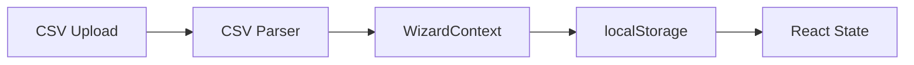
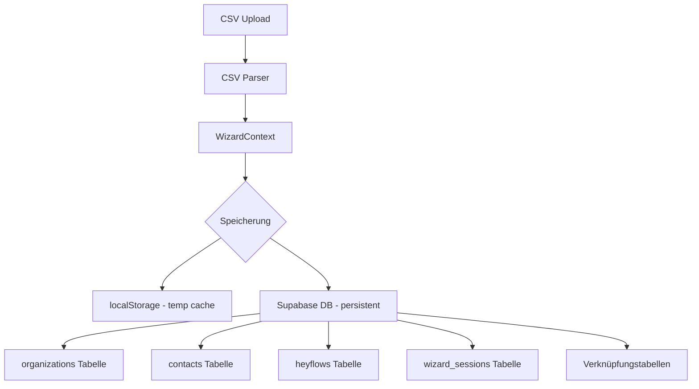
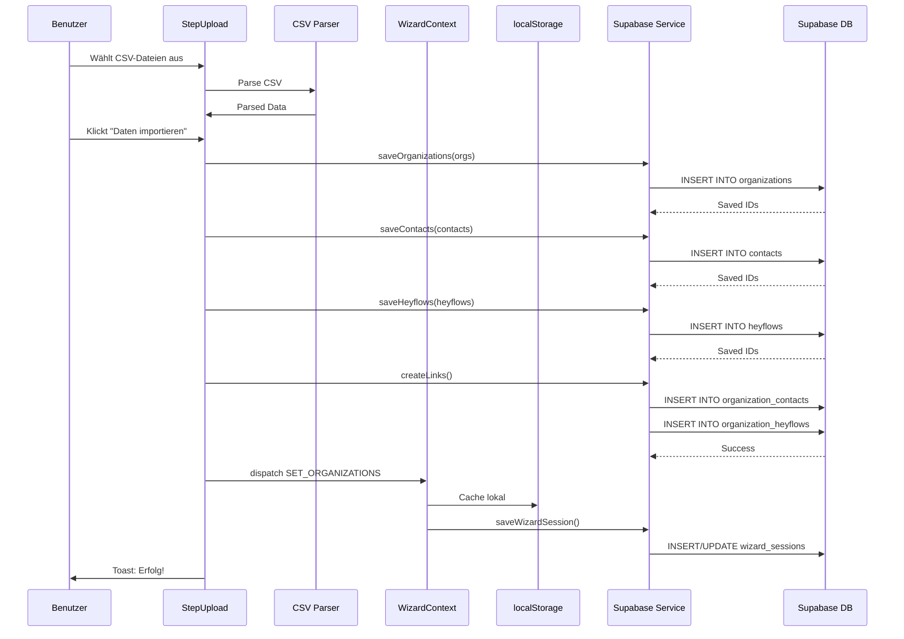

# Supabase Integration Plan: Upload-Daten in Datenbank speichern

## Problem

Die App speichert derzeit Upload-Daten nur im `localStorage`, nicht in der Supabase-Datenbank. Wenn Benutzer auf "Speichern" drücken, werden die Daten nicht persistent in der Datenbank gespeichert.

## Ist-Zustand

### Frontend-Datenfluss (aktuell)


### Probleme
1. ❌ Keine Supabase Client-Integration
2. ❌ Nur localStorage-Speicherung (nicht persistent, nur lokal)
3. ❌ Keine Synchronisierung mit Datenbank
4. ❌ Datenverlust bei Browser-Cache-Löschung

## Ziel-Zustand

### Frontend-Datenfluss (neu)


## Schema-Mapping-Analyse

### 1. Organizations Mapping

**App-Typ (`Organization`):**
```typescript
{
  id: string;
  name: string;
  street: string;
  zipCode: string;        // ⚠️ camelCase
  city: string;
  type: 'traeger' | 'einrichtung' | null;  // ⚠️ Nicht in DB!
  isValidated: boolean;   // ⚠️ Nicht in DB!
  parentOrganizationId?: string;  // ⚠️ Nicht in DB!
  contactPersonIds: string[];     // ⚠️ Array statt Verknüpfungstabelle
  heyflowIds: string[];          // ⚠️ Array statt Verknüpfungstabelle
  createdAt: string;
  updatedAt: string;
}
```

**DB-Schema (`organizations`):**
```sql
{
  id: uuid;
  name: text;
  street: text;
  zip_code: text;         // ⚠️ snake_case
  city: text;
  status: text;           // 'aktiv', 'in Bearbeitung', 'pausiert', 'gekündigt'
  company_id: uuid;       // FK zu companies
  archived_at: timestamptz;
  created_at: timestamptz;
  updated_at: timestamptz;
}
```

**Diskrepanzen:**
- ✅ `zipCode` vs `zip_code` - Naming-Konvention
- ❌ Fehlendes Feld: `type` (traeger/einrichtung) - **MUSS zur DB hinzugefügt werden**
- ❌ Fehlendes Feld: `isValidated` - **MUSS zur DB hinzugefügt werden**
- ❌ Fehlendes Feld: `parentOrganizationId` - **MUSS zur DB hinzugefügt werden**
- ❌ `contactPersonIds` vs `organization_contacts` Tabelle - Umstellung erforderlich
- ❌ `heyflowIds` vs `organization_heyflows` Tabelle - Umstellung erforderlich

### 2. ContactPerson Mapping

**App-Typ:**
```typescript
{
  id: string;
  name: string;
  email: string;
  createdAt: string;
}
```

**DB-Schema (`contacts`):**
```sql
{
  id: uuid;
  name: text;
  email: text;
  department: text;  // ⚠️ Optional in DB, nicht im App-Typ
  created_at: timestamptz;
  updated_at: timestamptz;
}
```

**Diskrepanzen:**
- ✅ Größtenteils kompatibel
- ⚠️ `department` fehlt im App-Typ (kann optional hinzugefügt werden)
- ⚠️ `updated_at` fehlt im App-Typ

### 3. Heyflow Mapping

**App-Typ:**
```typescript
{
  id: string;
  heyflowId: string;
  url: string;
  designation: string;
  createdAt: string;
}
```

**DB-Schema (`heyflows`):**
```sql
{
  id: uuid;
  heyflow_id: text;
  url: text;
  designation: text;
  created_at: timestamptz;
  updated_at: timestamptz;
}
```

**Diskrepanzen:**
- ✅ Vollständig kompatibel
- ⚠️ `updated_at` fehlt im App-Typ

### 4. WizardState Mapping

**App-Typ:**
```typescript
{
  currentStep: number;
  organizations: Organization[];
  contactPersons: ContactPerson[];
  heyflows: Heyflow[];
  isDataLoaded: boolean;
}
```

**DB-Schema (`wizard_sessions`):**
```sql
{
  id: uuid;
  session_name: text;
  current_step: integer;
  state_data: jsonb;      // ⚠️ Für komplexe State-Daten
  is_active: boolean;
  created_at: timestamptz;
  updated_at: timestamptz;
}
```

**Strategie:**
- Session-basierter Ansatz mit `wizard_sessions`
- `state_data` als JSONB für Zwischenzustände
- Relationen werden über normale Tabellen gespeichert

## Implementierungsplan

### Phase 1: Datenbank-Schema erweitern
**Fehlende Spalten zur `organizations` Tabelle hinzufügen:**

```sql
ALTER TABLE organizations
  ADD COLUMN type TEXT CHECK (type IN ('traeger', 'einrichtung')),
  ADD COLUMN is_validated BOOLEAN DEFAULT false,
  ADD COLUMN parent_organization_id UUID REFERENCES organizations(id);

CREATE INDEX idx_organizations_type ON organizations(type);
CREATE INDEX idx_organizations_parent ON organizations(parent_organization_id);
```

### Phase 2: Supabase Client einrichten

**Benötigte Dependencies:**
- `@supabase/supabase-js`

**Konfiguration:**
- `.env` Datei mit `VITE_SUPABASE_URL` und `VITE_SUPABASE_ANON_KEY`
- Supabase Client initialisieren in `src/lib/supabase.ts`

### Phase 3: Service Layer erstellen

**Neue Datei:** `src/lib/supabase-storage.ts`

Funktionen:
- `saveOrganizations()` - Speichert Organizations in DB
- `loadOrganizations()` - Lädt Organizations aus DB
- `saveContacts()` - Speichert Kontakte
- `saveHeyflows()` - Speichert Heyflows
- `linkOrganizationContact()` - Verknüpft Organization mit Contact
- `linkOrganizationHeyflow()` - Verknüpft Organization mit Heyflow
- `saveWizardSession()` - Speichert Wizard-Status
- `loadWizardSession()` - Lädt Wizard-Status

### Phase 4: TypeScript-Typen erweitern

**Aktualisierungen:**
- `ContactPerson` um `department?` und `updatedAt` erweitern
- `Heyflow` um `updatedAt` erweitern
- Neue Type Guards für Datenvalidierung
- Snake_case <-> camelCase Konverter

### Phase 5: WizardContext Integration

**Änderungen:**
- Reducer um Supabase-Speicherung erweitern
- Parallele Speicherung: localStorage (Cache) + Supabase (Persistent)
- Beim Laden: Supabase hat Priorität, localStorage als Fallback

### Phase 6: StepUpload Integration

**Änderungen in `handleImport()`:**
```typescript
const handleImport = async () => {
  try {
    // 1. Parse Daten (wie bisher)
    const organizations = csvToOrganizations(...);
    const contacts = csvToContactPersons(...);
    const heyflows = csvToHeyflows(...);
    
    // 2. In Supabase speichern (NEU!)
    const savedOrgs = await saveOrganizations(organizations);
    const savedContacts = await saveContacts(contacts);
    const savedHeyflows = await saveHeyflows(heyflows);
    
    // 3. Verknüpfungen erstellen (NEU!)
    await createOrganizationLinks(savedOrgs, savedContacts, savedHeyflows);
    
    // 4. State aktualisieren
    dispatch({ type: 'SET_ORGANIZATIONS', organizations: savedOrgs });
    dispatch({ type: 'SET_CONTACT_PERSONS', contactPersons: savedContacts });
    dispatch({ type: 'SET_HEYFLOWS', heyflows: savedHeyflows });
    
    // 5. Toast-Benachrichtigung
    toast.success('Daten erfolgreich in Datenbank gespeichert!');
  } catch (error) {
    toast.error('Fehler beim Speichern: ' + error.message);
  }
};
```

### Phase 7: RLS-Policies prüfen

**Wichtig:** Aktuell sind RLS-Policies aktiv, aber möglicherweise zu restriktiv!

**Zu prüfende Policies:**
- Können anonyme Benutzer Daten einfügen?
- Werden authentifizierte Benutzer benötigt?
- Welche Berechtigungen sind erforderlich?

**Mögliche Lösungen:**
1. RLS temporär deaktivieren für Development
2. Policy für öffentlichen Schreibzugriff erstellen
3. Auth-System implementieren

### Phase 8: Fehlerbehandlung & Validierung

- Try-Catch Blöcke für alle DB-Operationen
- Transaktionen für zusammenhängende Operationen
- Rollback bei Fehlern
- Toast-Benachrichtigungen für Benutzer
- Logging für Debugging

## Datenfluss-Diagramm (Detail)



## Benötigte Dateien (Neu/Geändert)

### Neue Dateien:
1. `src/lib/supabase.ts` - Supabase Client Setup
2. `src/lib/supabase-storage.ts` - DB-Operationen
3. `src/lib/type-converters.ts` - Snake/Camel Case Konverter
4. `.env.local` - Umgebungsvariablen (nicht committen!)

### Geänderte Dateien:
1. `src/types/organization.ts` - Typen erweitern
2. `src/lib/storage.ts` - Supabase-Integration
3. `src/context/WizardContext.tsx` - Supabase-Speicherung
4. `src/components/steps/StepUpload.tsx` - Import-Funktion
5. `package.json` - Supabase Dependency

### Migration:
1. `supabase/migrations/add_organization_fields.sql` - Schema-Update

## Risiken & Herausforderungen

### Technische Risiken:
1. **RLS-Policies** - Könnten Inserts blockieren
2. **Type Conversion** - snake_case ↔ camelCase Fehler
3. **Transaktionen** - Atomare Operationen bei Fehlern
4. **Performance** - Große CSV-Dateien könnten lange dauern

### Lösungsansätze:
1. RLS-Policies prüfen und anpassen
2. Automatische Type-Guards implementieren
3. Batch-Inserts statt einzelner Inserts
4. Progress-Indicator für Benutzer

## Testing-Strategie

### Testfälle:
1. ✅ Upload mit nur Hauptdatei
2. ✅ Upload mit allen 3 Dateien
3. ✅ Fehlerbehandlung bei ungültigen Daten
4. ✅ Daten laden nach Seiten-Reload
5. ✅ Duplikate verhindern
6. ✅ Große Dateien (>1000 Zeilen)

### Validierung:
- Supabase Dashboard prüfen, ob Daten ankommen
- Browser DevTools: Network Tab überwachen
- Console Logs für Debugging

## Zeitplan

Die Implementierung sollte schrittweise erfolgen:

1. **Schema-Update** (Critical Path)
2. **Client-Setup** (Parallel möglich)
3. **Service Layer** (Abhängig von 1+2)
4. **Integration** (Abhängig von 3)
5. **Testing** (Abhängig von 4)

## Nächste Schritte

Nach Zustimmung zu diesem Plan:
1. In **Code Mode** wechseln
2. Migration für Datenbankschema ausführen
3. Supabase Client installieren und konfigurieren
4. Service Layer implementieren
5. Integration in bestehende Komponenten
6. Testing und Validierung

---

**Erstellt am:** 2026-01-05
**Projekt:** datenbereinigung-fm
**Supabase Projekt-ID:** sgjehibstxczfymyrola
